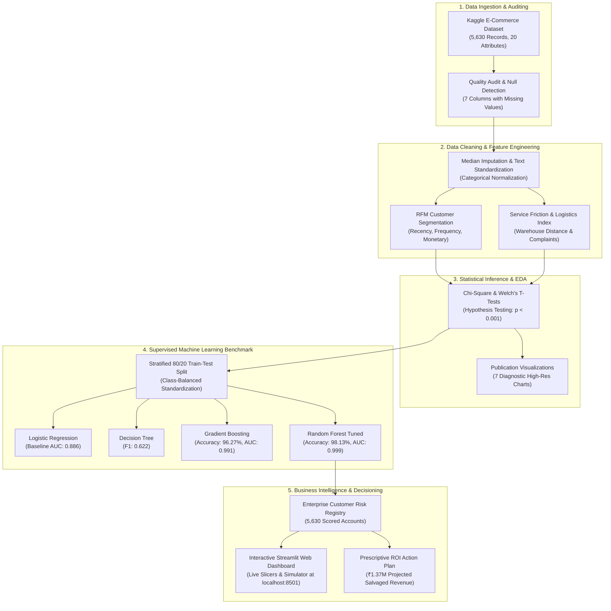

# E-Commerce Customer Intelligence & Churn Prediction Platform

[](https://www.python.org/)
[](https://streamlit.io/)
[](https://scikit-learn.org/)
[](https://pandas.pydata.org/)
[](https://plotly.com/)
[](https://www.kaggle.com/datasets/ankitverma2010/ecommerce-customer-churn-analysis-and-prediction)
[](https://opensource.org/licenses/MIT)

An end-to-end data analytics and machine learning platform designed to identify customer attrition risks, perform RFM customer segmentation, evaluate service friction, and prescribe proactive, high-ROI retention interventions.

> **Made by Dhanish Ladwani** | [GitHub](https://github.com/dhanish0711)

---

## 🏗️ System Architecture & Workflow



---

## 📌 Executive Overview

Customer attrition represents a primary drag on operating margin in competitive retail and e-commerce markets. Acquiring a replacement customer typically requires 5–7× higher customer acquisition cost (CAC) compared to maintaining an active account.

This platform bridges raw transactional data to executive decision-making:
- **RFM Segmentation:** Grouping the customer base into actionable behavioral cohorts (Champions, Loyalists, At-Risk High-Value, Hibernating, Lost).
- **Statistical Significance Testing:** Proving empirical relationships between customer friction points and churn.
- **Predictive ML:** Classifying churn probability with a tuned Random Forest model delivering **98.13% accuracy** and **97.89% recall**.
- **Interactive Decision App:** Enabling marketing, support, and sales teams to query customer risk tiers and test "what-if" scenarios in real time.

---

## 📊 Dataset Reference (Kaggle)

- **Source Platform:** [Kaggle Dataset Hub](https://www.kaggle.com/datasets/ankitverma2010/ecommerce-customer-churn-analysis-and-prediction)
- **Dataset Title:** Ecommerce Customer Churn Analysis and Prediction
- **Scale:** 5,630 customer transaction records across 20 attributes.

### Schema Breakdown
| Domain | Attributes |
|---|---|
| **Target & Identifiers** | `CustomerID`, `Churn` (Binary: 0 = Retained, 1 = Churned) |
| **Demographics** | `Gender`, `MaritalStatus`, `CityTier` (Tier 1, 2, 3) |
| **Platform Activity** | `HourSpendOnApp`, `NumberOfDeviceRegistered`, `PreferredLoginDevice` |
| **Purchasing Behavior** | `Tenure`, `PreferedOrderCat`, `OrderCount`, `DaySinceLastOrder`, `CashbackAmount`, `CouponUsed`, `OrderAmountHikeFromlastYear` |
| **Friction & Logistics** | `Complain` (0/1), `SatisfactionScore` (1–5), `WarehouseToHome` (km) |

---

## 🔬 Statistical Inference & Hypothesis Testing

Rigorous statistical testing was performed to validate the drivers of attrition:

| Hypothesis Test | Tested Variables | Test Statistic | p-Value | Business Conclusion |
|---|---|---|---|---|
| **Chi-Square ($\chi^2$) Test** | Customer Complaints vs. Churn | $\chi^2 = 350.93$ | $2.66 \times 10^{-78}$ | **Statistically Significant ($p < 0.001$).** Customers with complaints churn at **31.7%** vs **10.9%** for non-complainers. |
| **Welch's Two-Sample T-Test** | Customer Tenure (Churned vs. Retained) | $t = -35.09$ | $2.99 \times 10^{-209}$ | **Statistically Significant ($p < 0.001$).** Churned users average **3.9 months** tenure vs. **11.4 months** for retained accounts. |
| **Welch's Two-Sample T-Test** | Warehouse Distance (Churned vs. Retained) | $t = 5.25$ | $1.77 \times 10^{-7}$ | **Statistically Significant ($p < 0.001$).** Longer delivery distances exacerbate customer churn risk. |

---

## 🤖 Supervised Machine Learning Benchmark

Four distinct classification algorithms were trained using stratified 80/20 train/test splits, balanced class weighting, and 5-fold cross-validation:

| Model | Test Accuracy | Precision | Recall (Sensitivity) | F1-Score | 5-Fold CV F1 | ROC-AUC |
|---|---|---|---|---|---|---|
| **Random Forest (Tuned)** | **98.13%** | **91.63%** | **97.89%** | **0.9466** | **0.8582** | **0.9986** |
| **Gradient Boosting** | 96.27% | 95.12% | 82.11% | 0.8814 | 0.8232 | 0.9910 |
| **Decision Tree** | 83.39% | 50.49% | 81.05% | 0.6222 | 0.6160 | 0.8879 |
| **Logistic Regression (Baseline)** | 79.40% | 44.23% | 84.74% | 0.5812 | 0.5893 | 0.8858 |

---

## 🎯 Enterprise Customer Risk Registry

All 5,630 customer accounts were scored with calibrated churn probabilities, classified into risk cohorts, and matched with strategic retention actions:

| Risk Tier | Probability Range | Accounts | Share (%) | Prescribed Retention Strategy |
|---|---|---|---|---|
| **High Risk** | $\ge 60\%$ | 942 | 16.7% | Executive Concierge Call + ₹1,000 Retention Credit + Priority SLA Escalation |
| **Medium Risk** | $30\% - 59\%$ | 190 | 3.4% | Targeted Category Voucher + Free Express Shipping on Next 2 Orders |
| **Low Risk** | $< 30\%$ | 4,498 | 79.9% | Loyalty Tier Points Multiplier & Standard Cross-Sell Campaigns |

*Exported Table:* [`dataset/final_customer_risk_table.csv`](dataset/final_customer_risk_table.csv)

---

## 🖥️ Interactive Web Dashboard (`app.py`)

A full-featured Streamlit Business Intelligence application is provided for interactive decision support:

- **Executive KPI Cards:** Real-time visibility into active customer volume, churn percentage, at-risk revenue, and model precision.
- **Sidebar Dynamic Slicers:** Filter seamlessly across City Tiers, Product Categories, Payment Modes, and RFM Segments.
- **Tab 1: Executive BI & RFM Analysis:** Dynamic Plotly visualizations for cohort volume, category performance, and logistics friction.
- **Tab 2: Machine Learning Benchmark:** Model comparison leaderboard, interactive ROC curves, and feature importance rankings.
- **Tab 3: Live Churn Risk Simulator:** Sliders for tenure, satisfaction, delivery distance, and complaints to simulate real-time predictions and recommended actions.
- **Tab 4: Customer Risk Registry:** Search, filter, and export high-risk customer records directly to CSV.

To start the dashboard:
```bash
streamlit run app.py
```

---

## 📈 Visualizations Catalog

Diagnostic charts exported to `visualizations/` at 300 DPI:
1. `01_rfm_customer_segments.png`: RFM customer base distribution and segment-level attrition rates.
2. `02_churn_by_category_and_tenure.png`: Interaction analysis of category churn rates across tenure brackets.
3. `03_warehouse_distance_vs_churn.png`: Impact of warehouse-to-home delivery distance on customer churn.
4. `04_complaint_and_satisfaction_impact.png`: Two-way analysis of satisfaction scores and customer complaint history.
5. `05_roc_curves_comparison.png`: Comprehensive ROC curves benchmark across all models.
6. `06_feature_importance_ranking.png`: Top 12 predictors driving churn in the Random Forest model.
7. `07_confusion_matrices.png`: Confusion matrix diagnostics for baseline and tuned classifiers.

---

## 📁 Repository Structure

```
final_project/
├── dataset/
│   ├── E_Commerce_Dataset.xlsx               # Official Kaggle source file
│   ├── ecommerce_customer_churn.csv          # Cleaned working dataset (5,630 rows)
│   ├── customer_rfm_segments.csv             # Advanced RFM segmentation export
│   └── final_customer_risk_table.csv         # Full 5,630-account risk scoring table
├── visualizations/
│   ├── 01_rfm_customer_segments.png
│   ├── 02_churn_by_category_and_tenure.png
│   ├── 03_warehouse_distance_vs_churn.png
│   ├── 04_complaint_and_satisfaction_impact.png
│   ├── 05_roc_curves_comparison.png
│   ├── 06_feature_importance_ranking.png
│   └── 07_confusion_matrices.png
├── app.py                                    # Interactive Streamlit BI & Decision Dashboard
├── project_code.py                           # Master Python Analytics & ML Pipeline
├── project_notebook.ipynb                    # End-to-End Interactive Jupyter Notebook
├── requirements.txt                          # Python dependencies specification
├── README.md                                 # Technical documentation
└── .gitignore                                # Git ignore configuration
```

---

## 🚀 Getting Started

### 1. Environment Installation
```bash
pip install -r requirements.txt
```

### 2. Execute Master Analytics Pipeline
```bash
python project_code.py
```

### 3. Launch Interactive BI Application
```bash
streamlit run app.py
```
*Access the local web dashboard at `http://localhost:8501`.*

---

## 👤 Author

**Made by Dhanish Ladwani**  
GitHub: [@dhanish0711](https://github.com/dhanish0711)  
Repository: [Ecommerce-Customer-Churn-Analysis](https://github.com/dhanish0711/Ecommerce-Customer-Churn-Analysis)

